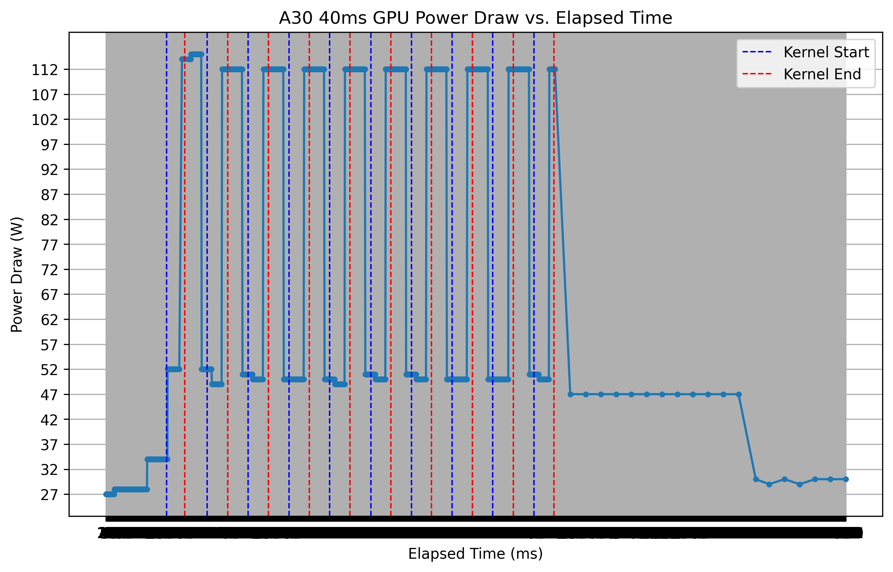

 
# GPU Metrics Collection Tool

A high-precision tool for collecting and analyzing NVIDIA GPU performance metrics using NVML and CUDA.

## Overview

This tool allows you to:
- Collect real-time GPU metrics (power, utilization, clock speeds, energy) at precise intervals
- Run configurable GPU workloads with multiple iterations
- Export metrics to CSV for further analysis
- Measure kernel execution latency

The metrics collection runs continuously, capturing data during both kernel execution and the delay periods between runs, providing a complete picture of GPU behavior.

## Requirements

- NVIDIA GPU with CUDA support
- CUDA Toolkit (10.0 or later recommended)
- NVML library (included with CUDA)
- C++ compiler with C++11 support

## Building

The project uses a Makefile for building:

```bash
# Build the executable
make

# Clean build artifacts
make clean
```

This will create the executable in the `bin` directory.

## Usage

```bash
./bin/gpu_bench <sampling_period> <num_runs> <delay_between_runs> <scale> <percent>
```

### Parameters

- `sampling_period`: Time in milliseconds between metric samples (e.g., 1 for 1ms)
- `num_runs`: Number of kernel executions to perform
- `delay_between_runs`: Time in milliseconds to wait between kernel executions
- `scale`: Workload intensity multiplier
- `percent`: Percentage of GPU SMs to utilize (1-100)

### Example

```bash
# Run with custom parameters
./bin/gpu_bench 1 10 2000 5 80

# Or use the Makefile run target with default parameters
make run

# Or use the custom_run target with your own parameters
make custom_run ARGS="1 10 2000 5 80"
```

This will:
- Sample metrics every 1ms
- Run the kernel 10 times
- Wait 2000ms (2 seconds) between runs
- Use a workload scale factor of 5
- Utilize 80% of the GPU's streaming multiprocessors

## Output

The tool produces two types of output:

1. **Console output** showing:
   - Run progress
   - Kernel start and end timestamps
   - Kernel execution latency
   - Delay period timestamps

2. **CSV file** (`metrics.csv`) containing:
   - Timestamp (ms)
   - Power consumption (W)
   - SM utilization (%)
   - Memory utilization (%)
   - SM clock speed (MHz)
   - Memory clock speed (MHz)
   - Energy consumption (J)

## Data Analysis

You can analyze the collected data using the included Jupyter nootbook `plot.ipynb`

This will generate a plot of power consumption over time, with statistics about average, minimum, and maximum power usage.

## Example Visualization



## Advanced Usage

### Customizing the Workload

The kernel in this tool performs a simple arithmetic operation repeated in a loop. You can modify the `kernel` function in the source code to create different types of workloads.

### Collecting Additional Metrics

NVML provides access to many GPU metrics beyond those included by default. You can extend the `TimestampedMetrics` struct and the monitoring thread to collect additional data points.

### Makefile Options

The Makefile provides several useful targets:

```bash
# Display help information
make help

# Run with default parameters (5ms sampling, 10 runs, 1000ms delay, scale 1, 80% utilization)
make run

# Run with custom parameters
make custom_run ARGS="1 5 500 2 50"
```

## Project Structure

```
.
├── bin/              # Compiled binaries
├── obj/              # Object files
├── src/              # Source code
│   └── *.cu          # CUDA source files
├── Makefile          # Build configuration
├── plot.ipynb        # Notebook to plot power vs elapsed time
└── README.md         # This file
```

## Troubleshooting

### Energy Measurement Not Available

Some GPUs do not support energy measurement through NVML. In this case, you'll see a warning message, and the energy values in the CSV will be zeros.

### Sampling Rate Too High

If you set the sampling period too low (e.g., below 1ms), the system might not be able to keep up, resulting in irregular sampling intervals. A sampling period of 1-10ms is recommended for most systems.

### Compilation Issues

If you encounter compilation issues:
- Ensure CUDA toolkit is properly installed
- Check that the CUDA_PATH in the Makefile points to your CUDA installation
- Verify that your GPU architecture is supported (modify the `-gencode` flag in the Makefile if needed)

